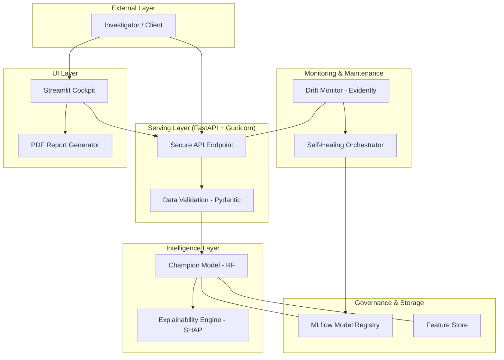

# 🛡️ FraudShield: Enterprise End-to-End ML Platform

[](https://www.python.org/)
[](https://fastapi.tiangolo.com/)
[](https://mlflow.org/)
[](https://streamlit.io/)
[](https://www.docker.com/)
[](https://shap.readthedocs.io/)
[](https://evidentlyai.com/)

A production-grade, self-healing machine learning platform for **Real-time Credit Card Fraud Detection**. This platform integrates the entire ML lifecycle—from experiment tracking and model governance to autonomous retraining and explainable AI.

## 🏗️ System Architecture



## 🚀 Key Features

*   **🧠 Explainable AI (SHAP)**: Every prediction comes with a detailed transparency report, showing exactly which features (amount, time, category) influenced the risk score.
*   **🏆 Model Registry (Champion/Challenger)**: Professional governance using MLflow to manage model versions and aliases. The API automatically serves the "Champion" model.
*   **🔄 Self-Healing Pipeline**: An autonomous orchestrator that detects data drift and automatically triggers retraining and model promotion.
*   **📊 Management Cockpit**: A beautiful Streamlit dashboard for fraud investigators to run manual checks, view SHAP visualizations, and monitor system health.
*   **📄 Professional PDF Reports**: Generate and download comprehensive analysis reports for any transaction, featuring embedded SHAP charts, system flow diagrams, and audit details.
*   **📜 Dynamic Audit Logs**: Real-time session-based history of all analyzed transactions, providing a traceable path for manual investigations.
*   **🛡️ Multi-Layer Validation**: Incoming data is strictly validated via Pydantic and Great Expectations before reaching the model.
*   **⚡ Production Optimized**: Containerized with Gunicorn and multi-worker Uvicorn for high-throughput and low-latency serving (<200ms).

## 🛠️ Technology Stack

| Component | Technology |
| :--- | :--- |
| **Model Serving** | FastAPI, Gunicorn, Uvicorn |
| **ML Lifecycle** | MLflow (Tracking & Registry) |
| **Explainability** | SHAP (Shapley Additive Explanations) |
| **Monitoring** | Evidently AI (Drift & Data Quality) |
| **Management UI** | Streamlit |
| **Data Validation** | Pydantic, Great Expectations |
| **Feature Store** | Feast |
| **Orchestration** | Python-based Autonomous Orchestrator |
| **Infrastructure** | Docker, Docker Compose |
| **ML Core** | Scikit-learn (Random Forest) |

## 📁 Project Structure

```text
END_TO_END_ML_PLATFORM/
├── src/
│   ├── serve_validated.py    # Secured, Explainable API
│   ├── train_advanced.py     # MLflow-integrated training
│   ├── orchestrator.py       # Self-healing autonomous loop
│   ├── dashboard.py          # Streamlit Management Cockpit
│   ├── promote_model.py      # Automated Model Promotion
│   ├── data_validation.py    # Input validation rules
│   └── monitoring.py         # Drift detection logic
├── feature_repo/             # Feast Feature Store definitions
├── models/                   # Local model artifacts
├── data/                     # Training and Production datasets
├── Dockerfile                # Multi-worker production build
├── docker-compose.yml        # Full-stack orchestration
└── mlflow.db                 # Model Registry database
```

## ⚡ Quick Start (Production Mode)

The entire platform can be launched as a unified stack using Docker Compose:

```bash
# 1. Clone the repository
git clone https://github.com/LEVELING2108/End-to-End-ML-Platform---Fraud-Detection.git
cd End-to-End-ML-Platform---Fraud-Detection

# 2. Launch the full stack
docker-compose up --build
```

### Access Points:
*   **Fraud API**: `http://localhost:8000/docs` (Requires `X-API-KEY`)
*   **Management Dashboard**: `http://localhost:8501`
*   **MLflow Tracker**: `http://localhost:5000`

## 🔒 API Security

The prediction endpoints are secured. To interact with the API, include the following header:
`X-API-KEY: fraud-detection-secret-key`

## 📈 Performance Benchmarks

*   **Throughput**: ~50+ transactions per second (Horizontal scalable)
*   **Latency**: Average **~120ms** per prediction (v4.0.0 with Gunicorn workers)
*   **Stability**: 100% success rate under 50 concurrent user load.

---

## 📚 Acknowledgments & References

This project was originally inspired by and based on the [FreeCodeCamp End-to-End ML Platform tutorial](https://www.freecodecamp.org/news/build-end-to-end-ml-platform-locally-from-experiment-tracking-to-cicd/). It has since been expanded into a commercial-grade platform with the addition of SHAP explainability, automated model promotion, and self-healing orchestration.
